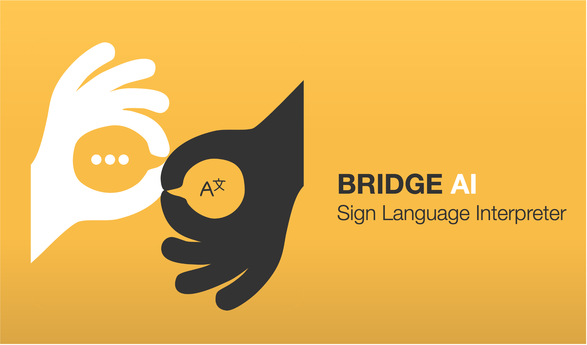
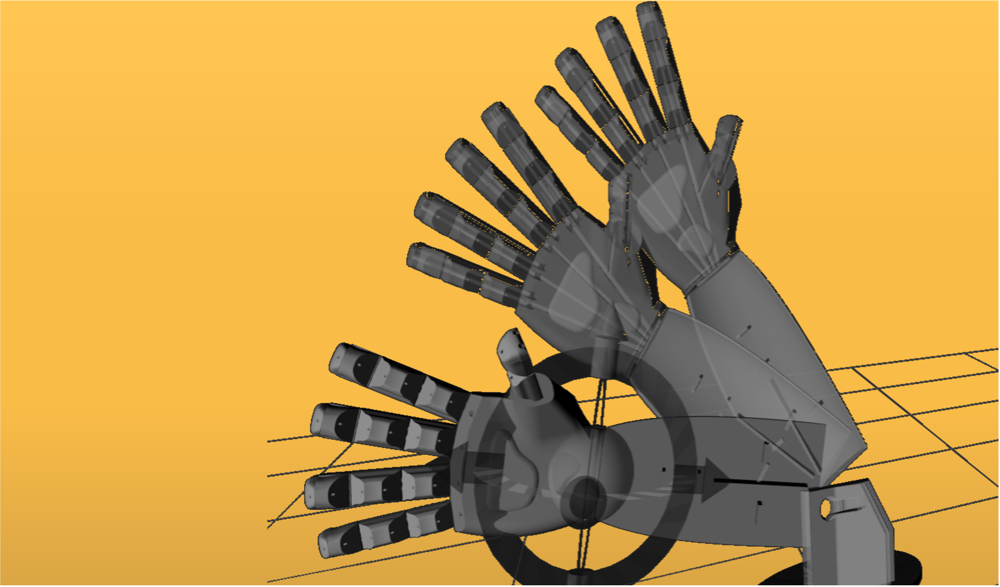
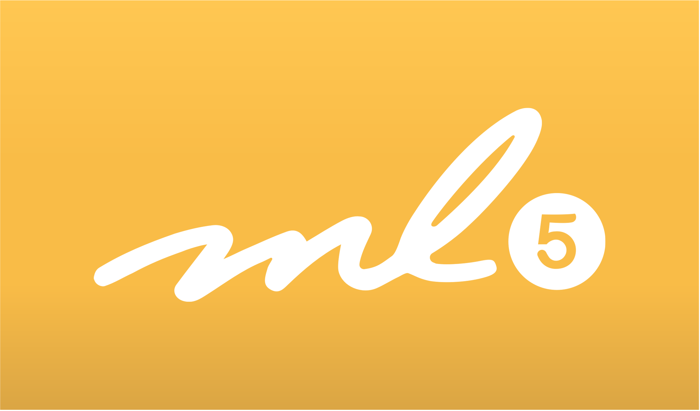
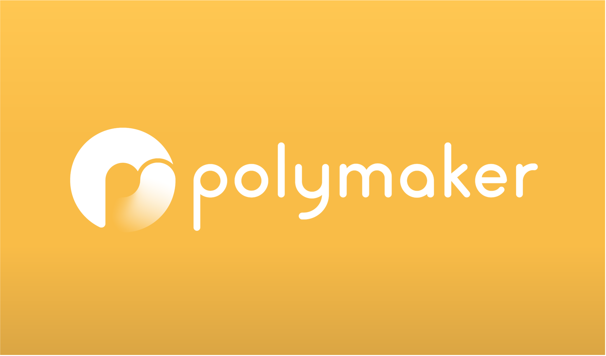
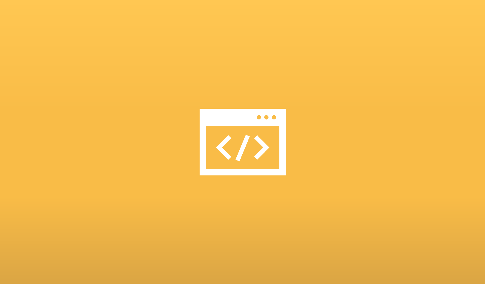

<h1 align="center">Hi, I'm Mathew Ponon 👋</h1>

Computer Systems Engineering student at NYU, focused on Electronics, Robotics & AI.

  <a href="mailto:mop9047@nyu.edu">📧 Email</a> •
  <a href="https://mwathew.com">🌐 Portfolio</a> •
  <a href="https://github.com/mop9047">💻 GitHub</a>

---

## 🚀 Recent Projects

<table>
  <tr>
    <td width="33%">
      
      <h3>🤚 BRIDGE-AI: Sign Language Interpreter</h3>
      
This is a project I am most passionate about! This project translates sign language into written text using Deep Learning.

      
      
      
    </td>
    <td width="33%">
      
      <h3>🤖 Development of Controls for Robotic Arm - NYUAD Cybersecurity Lab</h3>
      
Research about creating and experimenting with a robotic arm using different tools.

      
      
      
    </td>
    <td width="33%">
      
      <h3>🖥️ ML5.js Open Source Contributions</h3>
      
Summer project researching for ML5.js a Machine Learning library that makes ML accessible to everyone.

      
      
      
    </td>
  </tr>
  <tr>
    <td width="33%">
      
      <h3>🖨️ Polymaker Product Developer</h3>
      
This summer I was working with Polymaker in Shanghai to create 3D printable models to showcase their new filament product line.

      
      
    </td>
    <td width="33%">
      
      <h3>💻 Creative Coding Exhibition</h3>
      
This project is a collection of all interactive websites/canvasses that I have made, showcasing both creativity and problem-solving skills.

      
      
      
    </td>
    <td width="33%">
    </td>
  </tr>
</table>

---

## 🛠️ Tech Stack

**Languages:**      -239120?style=flat-square>)

**Hardware & EDA:**    

**Embedded & Firmware:**   

**Robotics & Simulation:**    

---

## 🏆 Awards

- **2024 Best Researcher** (Student Research Category) — NYU Abu Dhabi eBrain Lab
