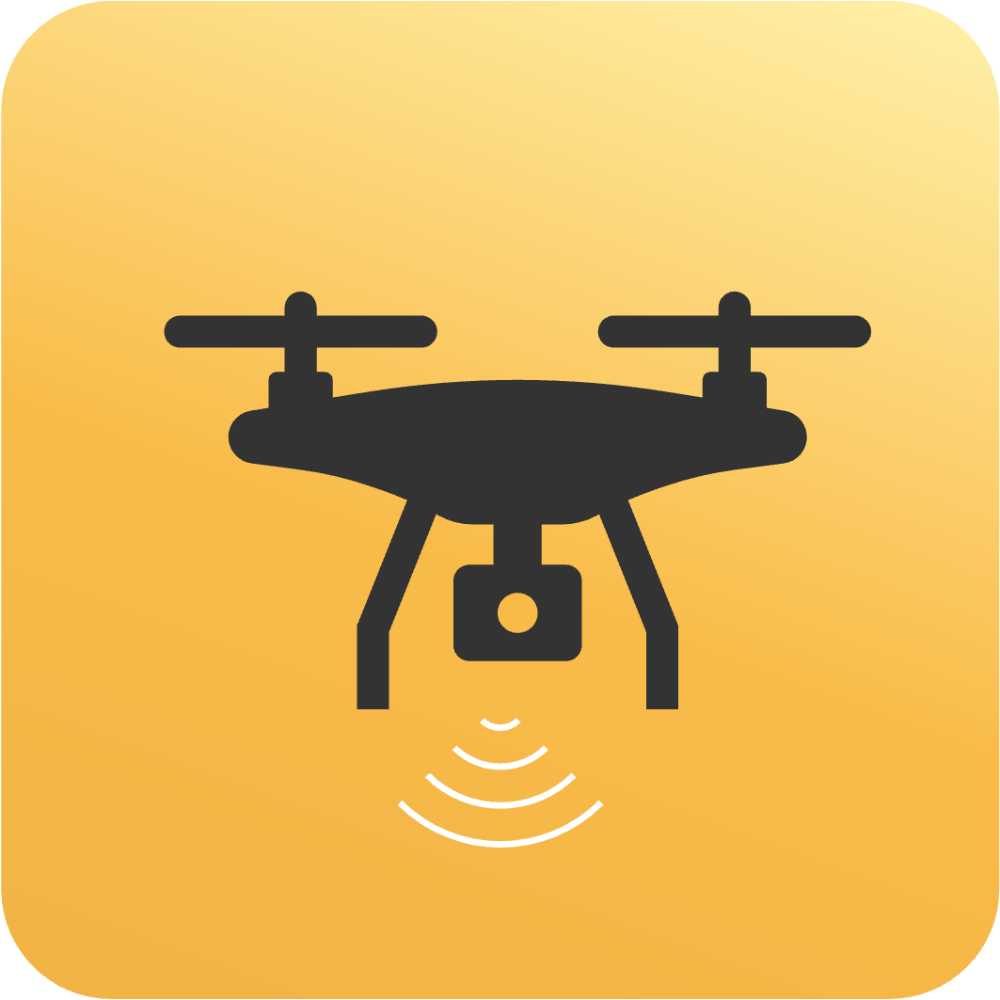
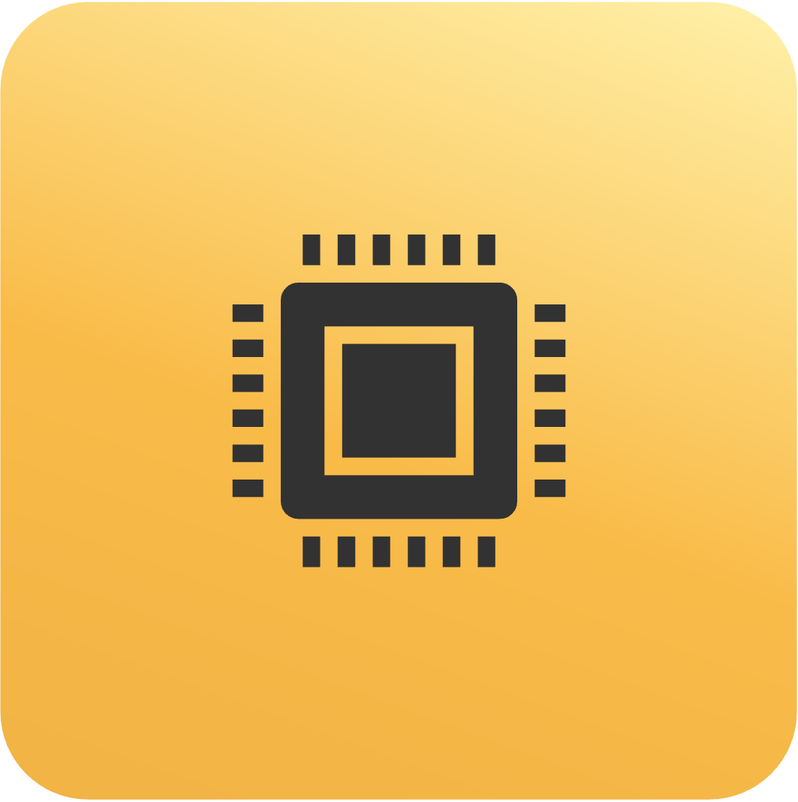
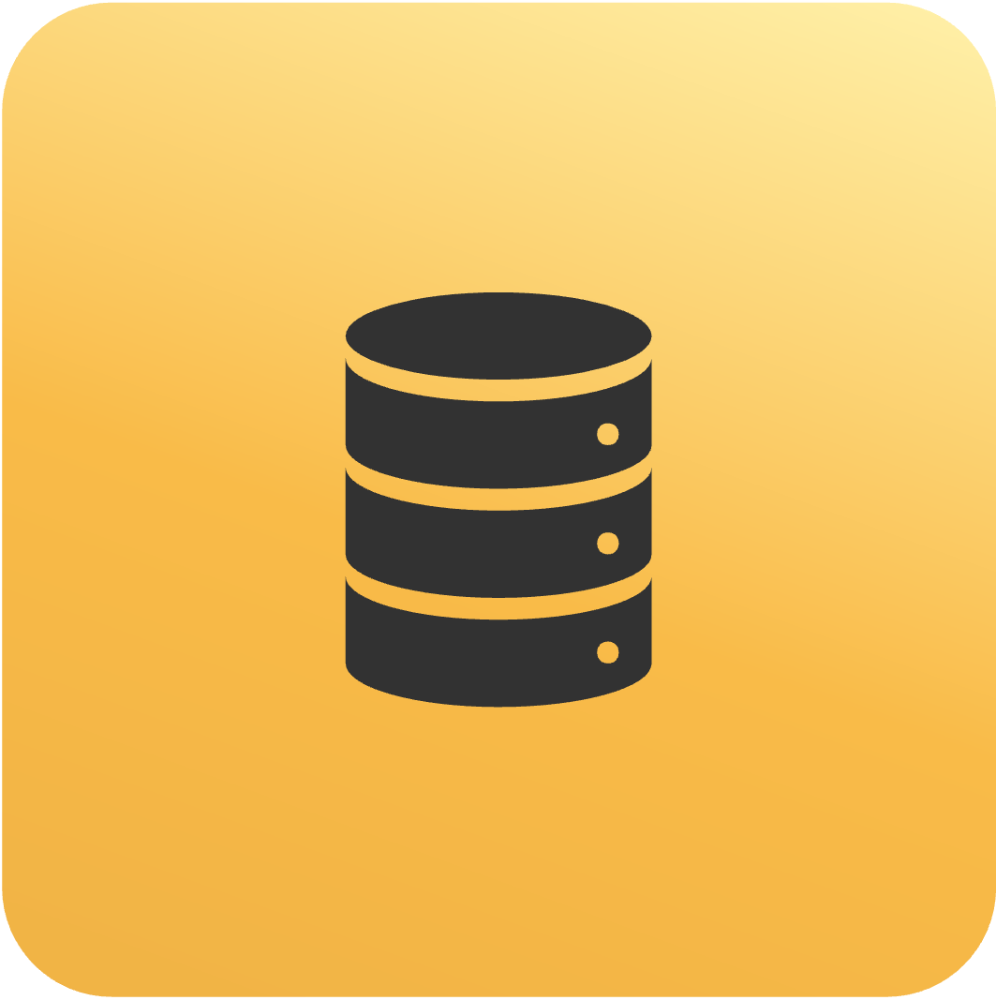
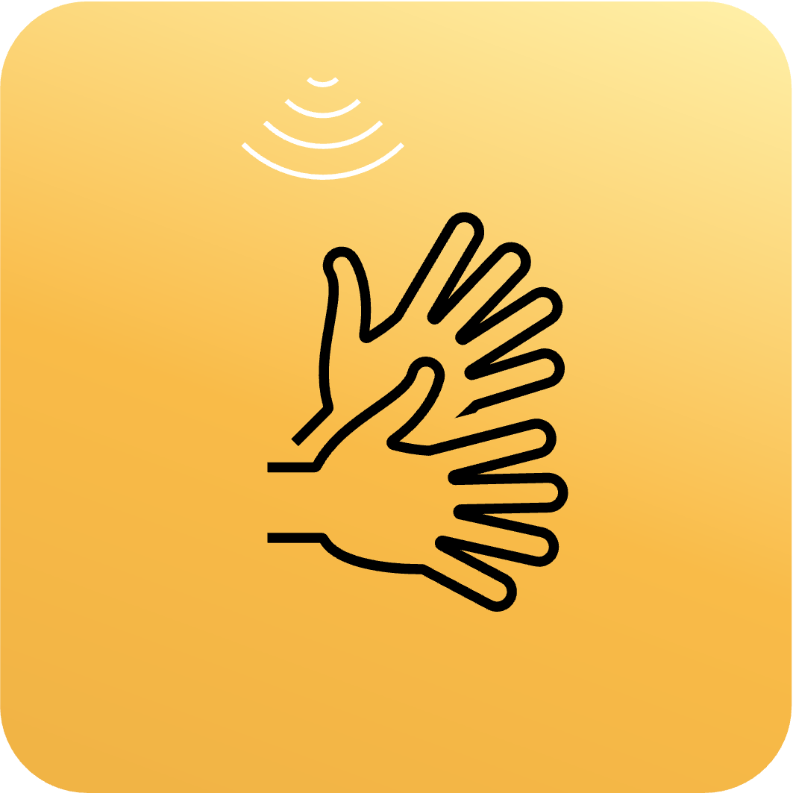
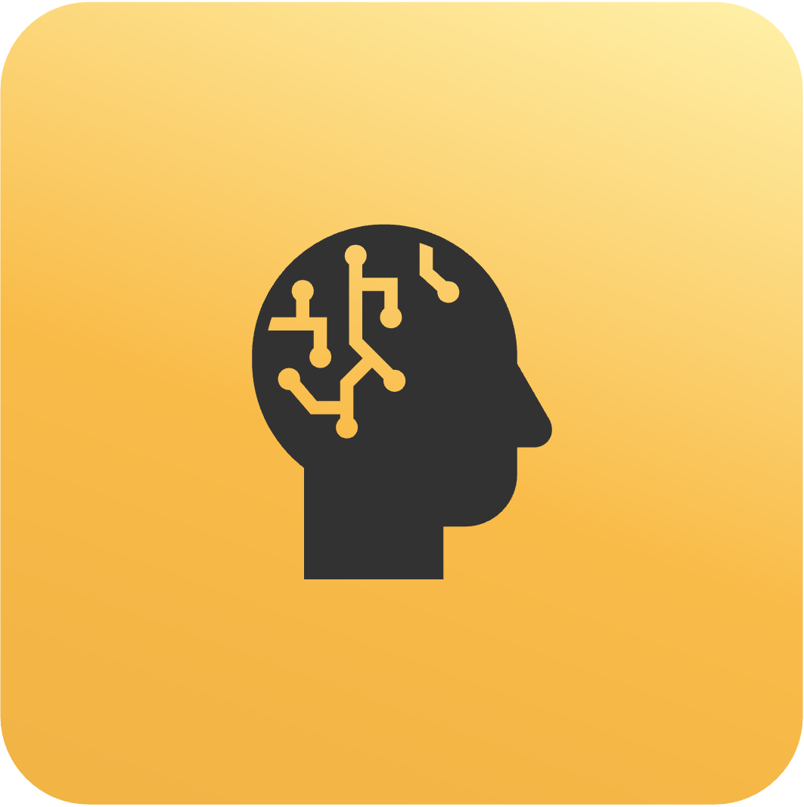

<h2 align="center">Hi, I'm Mathew Ponon 👋</h2>

Computer Systems Engineering Graduate from NYU, focused on Electronics, Robotics & AI.

## 🚀 Recent Projects

<table>
  <tr>
    <td width="33%">
      
      <h4>BRIDGE-AI: Sign Language Interpreter</h4>
      
My most important project! This project translates sign language into written text using Deep Learning.

      
      
      
    </td>
    <td width="33%">
      
      <h4>Robot Arm Sim NYU Abu Dhabi eBrain Lab</h4>
      
Research about creating and experimenting with a robotic arm with simulation and physical validation.

      
      
      
    </td>
    <td width="33%">
      
      <h4>ML5.js Open Source Contributions</h4>
      
Summer project researching for ML5.js a Machine Learning library that makes ML accessible to everyone.

      
      
      
    </td>
  </tr>
</table>

<table>
  <tr>
    <td width="20%">
      
      <h5>GPS-Denied Autonomous Drone</h5>
    </td>
    <td width="20%">
      
      <h5>Custom ECG Circuit Designed with Altium</h5>
    </td>
    <td width="20%">
      
      <h5>Database Design for Airline Flight Booking</h5>
    </td>
    <td width="20%">
      
      <h5>Parkinsons Classification</h5>
    </td>
    <td width="20%">
      
      <h5>LLM-based Simple game-capable agent</h5>
    </td>    
  </tr>
</table>

---

## 🛠️ Tech Stack

**Languages:**      -239120?style=flat-square>)

**Hardware & EDA:**    

**Embedded & Firmware:**   

**Robotics & Simulation:**    

---

## 🏆 Awards

- **2024 Best Researcher** (Student Research Category) — NYU Abu Dhabi eBrain Lab
